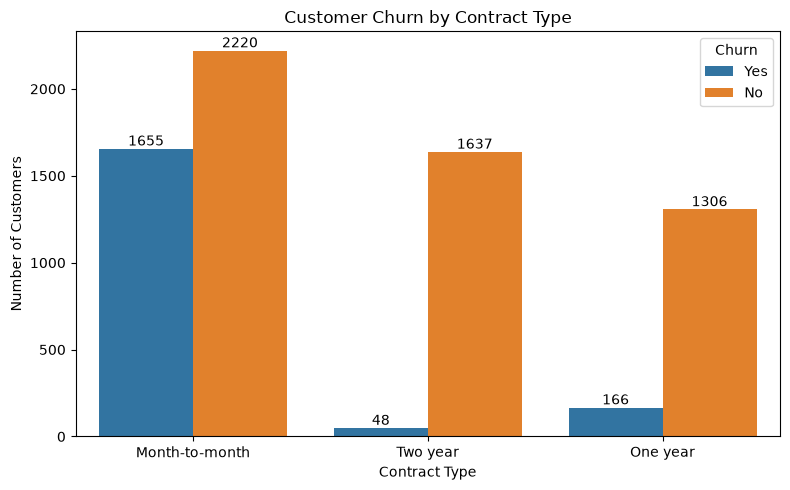
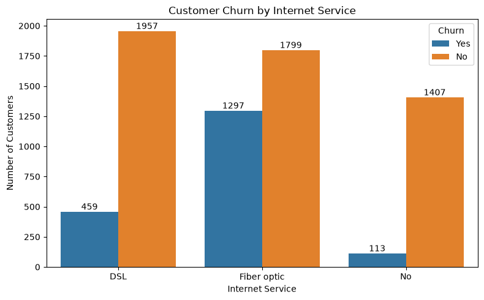
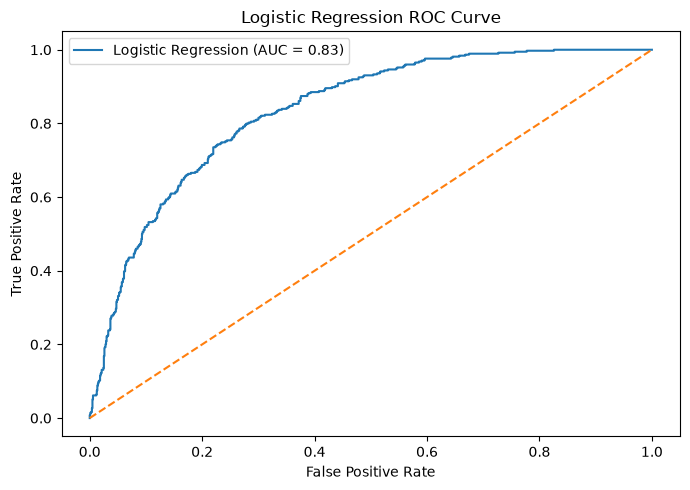
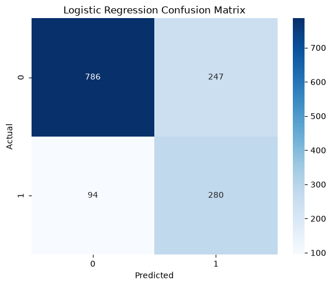

# Customer Churn Prediction

## Project Overview

This project analyzes customer churn using the **IBM Telco Customer Churn** dataset.

The main goal is to identify customer characteristics associated with churn and build a Machine Learning model capable of identifying customers who are more likely to leave the company.

The project combines **Exploratory Data Analysis (EDA)** with a **Logistic Regression** classification model, focusing not only on predictive performance but also on the interpretation of customer churn patterns.

---

## Objective

The main objectives of this project are to:

* Explore the customer dataset and identify patterns related to churn.
* Analyze how characteristics such as contract type, tenure, internet service, payment method, and monthly charges relate to customer cancellation.
* Prepare categorical and numerical features for Machine Learning.
* Handle class imbalance using SMOTE.
* Train a Logistic Regression model as an interpretable classification baseline.
* Evaluate the model using multiple classification metrics.
* Translate the analytical results into insights that could support customer retention strategies.

---

## Dataset

The project uses the **IBM Telco Customer Churn** dataset.

**Original dataset source:** <https://www.kaggle.com/datasets/yeanzc/telco-customer-churn-ibm-dataset/data>

The original dataset contains:

* **7,043 customers**
* **33 variables**
* Customer demographics
* Account information
* Contract information
* Internet and phone services
* Payment information
* Monthly and total charges
* Churn information

During data cleaning, invalid values in `Total Charges` were converted and rows with missing Total Charges were removed, resulting in **7,032 observations** used in the analysis.

The target variable used for Machine Learning is:

`Churn Value`

Where:

* `0` = Customer did not churn
* `1` = Customer churned

---

## Exploratory Data Analysis

The exploratory analysis investigated the relationship between customer churn and several customer characteristics.

### Churn Distribution

Approximately:

* **73.42%** of customers remained with the company.
* **26.58%** of customers churned.

This indicates a moderately imbalanced target variable.

### Contract Type

Contract type showed one of the strongest relationships with churn.

| Contract Type | Churn Rate |
| --- | ---: |
| Month-to-month | 42.71% |
| One year | 11.28% |
| Two year | 2.85% |



Customers with **month-to-month contracts** were substantially more likely to churn, while customers with long-term contracts showed considerably higher retention.

### Internet Service

Churn rates also varied significantly according to internet service type.

| Internet Service | Churn Rate |
| --- | ---: |
| Fiber optic | 41.89% |
| DSL | 19.00% |
| No internet service | 7.43% |



Customers using **Fiber Optic internet service** showed a considerably higher churn rate compared with DSL customers and customers without internet service.

### Payment Method

Customers using **Electronic Check** had the highest churn rate among payment methods:

| Payment Method            | Churn Rate |
| ------------------------- | ---------: |
| Electronic check          |     45.29% |
| Mailed check              |     19.20% |
| Bank transfer (automatic) |     16.73% |
| Credit card (automatic)   |     15.25% |

### Tenure

Tenure showed an important relationship with customer churn.

Customers who churned had a median tenure of approximately **10 months**, compared with approximately **38 months** among customers who remained.

This suggests that customers are particularly vulnerable to churn during the earlier stages of their relationship with the company.

### Monthly Charges

Customers who churned tended to have higher monthly charges.

The median Monthly Charge was approximately:

* **79.65** for churned customers
* **64.45** for non-churned customers

### Correlation Analysis

The correlation analysis showed:

* `Tenure Months` and `Churn Value`: **-0.35**
* `Monthly Charges` and `Churn Value`: **0.19**
* `Total Charges` and `Churn Value`: **-0.20**

A strong relationship was also observed between:

* `Tenure Months` and `Total Charges`: **0.83**
* `Monthly Charges` and `Total Charges`: **0.65**

These relationships were considered when interpreting the Machine Learning model.

---

## Data Preprocessing

Before model training, the following preprocessing steps were performed:

1. Converted `Monthly Charges` and `Total Charges` to numerical values.
2. Removed observations with invalid `Total Charges`.
3. Removed identifiers, geographic variables, and variables that could introduce data leakage.
4. Separated the predictors from the `Churn Value` target.
5. Encoded categorical variables using one-hot encoding with `pandas.get_dummies()`.
6. Split the dataset into:

   * **80% training data**
   * **20% test data**
7. Used stratified sampling to preserve the churn distribution between training and test sets.
8. Standardized:

   * `Tenure Months`
   * `Monthly Charges`
   * `Total Charges`
9. Applied **SMOTE** only to the training dataset to address class imbalance.

After encoding, the model used **30 features**.

---

## Machine Learning Model

### Logistic Regression

Logistic Regression was selected as the baseline classification model because it provides both predictive capability and interpretability.

The model was trained using the SMOTE-balanced training dataset and evaluated on the original, untouched test dataset.

---

## Model Performance

The Logistic Regression model achieved the following results:

| Metric    |      Score |
| --------- | ---------: |
| Accuracy  | **75.76%** |
| Precision | **53.13%** |
| Recall    | **74.87%** |
| F1-Score  | **62.15%** |
| ROC-AUC   | **83.49%** |

Because churn is an imbalanced classification problem, **Recall, F1-Score, and ROC-AUC** are particularly useful for evaluating the model.

The recall of approximately **74.9%** means that the model successfully identified almost **three out of every four customers who actually churned**.

The ROC-AUC score of approximately **0.835** also indicates good discriminatory ability between churners and non-churners.

---

### ROC Curve



The ROC curve illustrates the model's ability to distinguish between customers who churn and customers who remain across different classification thresholds.

The model achieved a **ROC-AUC score of approximately 0.835**, indicating good discriminatory performance and performing substantially better than random classification.

---

## Confusion Matrix



On the test dataset, the model produced:

| | Predicted No Churn | Predicted Churn |
| --- | ---: | ---: |
| **Actual No Churn** | 786 | 247 |
| **Actual Churn** | 94 | 280 |

The model correctly identified:

- **786 non-churn customers**
- **280 churn customers**

It missed **94 customers who actually churned**, while **247 non-churn customers** were classified as potential churners.

From a customer retention perspective, the relatively high recall can be useful because it allows the model to identify a large proportion of customers who may require retention actions.

---

## Logistic Regression Coefficients

The Logistic Regression coefficients were analyzed to better understand the relationships learned by the model.

Some results were consistent with the exploratory analysis:

* **Longer tenure** was negatively associated with churn.
* **Two-year contracts** were negatively associated with churn.
* **Fiber Optic internet service** showed a strong positive association with churn.

Some service-related features are correlated with each other and with customer charges. Because of this multicollinearity, individual coefficient magnitudes and directions should be interpreted carefully.

For example, while higher Monthly Charges were associated with higher churn during the exploratory analysis, the Logistic Regression coefficient for Monthly Charges became negative when the other customer characteristics and services were held constant.

Therefore, the coefficients should be interpreted as relationships within the model rather than direct causal effects.

---

## Project Structure

```text
customer-churn-prediction/
│
├── data/
│   └── Telco_customer_churn.csv
│
├── notebooks/
│   └── churn_analysis.ipynb
│
├── images/
│   ├── churn_by_contract.png
│   ├── churn_by_internet_service.png
│   ├── confusion_matrix.png
│   └── roc_curve.png
│
├── README.md
└── requirements.txt
```

---

## Technologies

The project was developed using:

* Python
* Pandas
* NumPy
* Matplotlib
* Seaborn
* Scikit-Learn
* Imbalanced-Learn
* Jupyter Notebook

---

## How to Run the Project

### 1. Install the required libraries

```bash
pip install -r requirements.txt
```

### 2. Make sure the dataset is located in

```text
data/Telco_customer_churn.csv
```

### 3. Open the notebook

```bash
jupyter notebook
```

Then open:

```text
notebooks/churn_analysis.ipynb
```

and run the cells in order.

---

## Conclusion

The analysis identified several customer characteristics associated with churn.

Customers with **shorter tenure**, **month-to-month contracts**, **Fiber Optic internet service**, and certain payment methods showed higher churn rates during the exploratory analysis.

The Logistic Regression model achieved a **ROC-AUC of approximately 83.5%** and identified approximately **74.9% of the customers who actually churned**, providing a useful and interpretable baseline for customer churn prediction.

The project demonstrates how exploratory data analysis and Machine Learning can be combined to identify customer behavior patterns and support potential customer retention strategies.

Future improvements could include:

* Classification threshold optimization
* Additional feature engineering
* Comparison with other classification algorithms
* Hyperparameter tuning